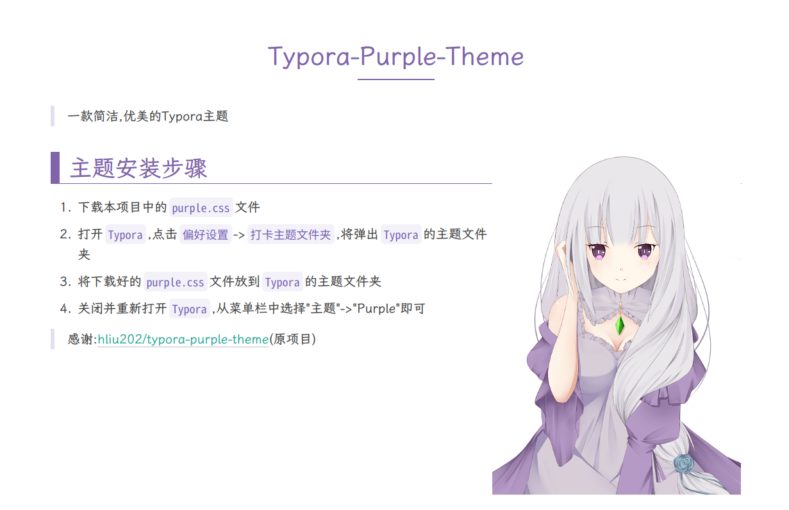

# Typora-Purple-Theme

> 一款简洁,优美的Typora主题

## 主题预览

## 主题安装步骤

1. 下载本项目中的`purple.css`文件
2. 打开`Typora`,点击`偏好设置`->`打卡主题文件夹`,将弹出`Typora`的主题文件夹
3. 将下载好的`purple.css`文件放到`Typora`的主题文件夹
4. 关闭并重新打开`Typora`,从菜单栏中选择"主题"->"Purple"即可

## 我的更改

* 将全局文本字体替换成`霞鹜文楷屏幕阅读版`([LXGW WenKai Screen / 霞鹜文楷屏幕阅读版](https://github.com/lxgw/LxgwWenKai-Screen))